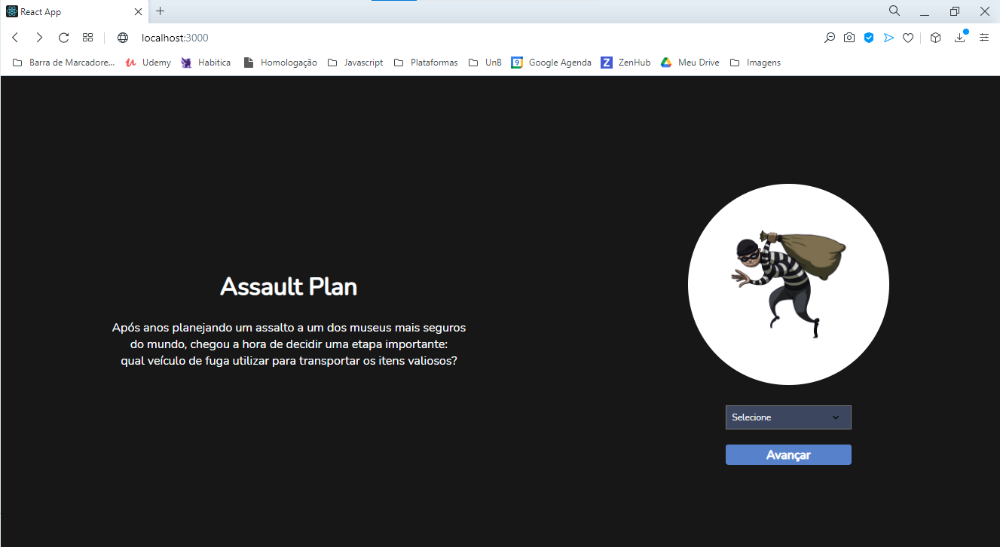
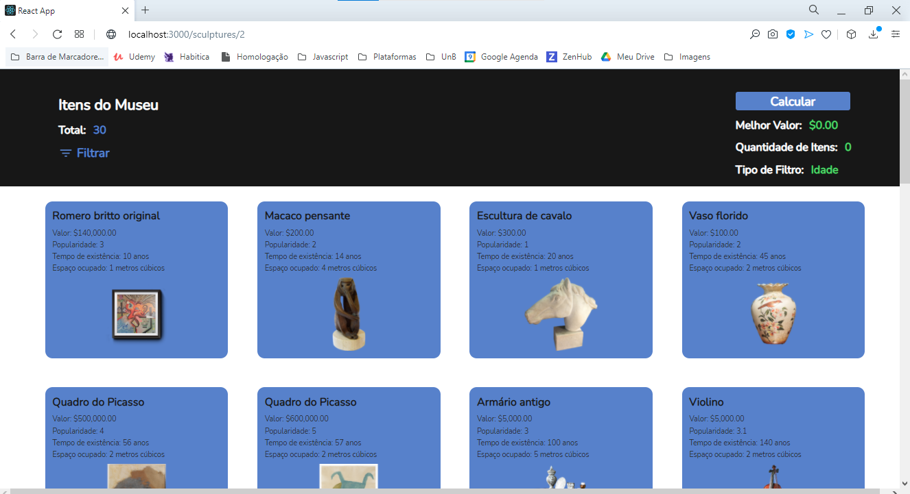
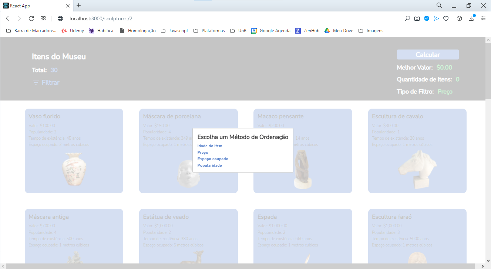

# MuseumSort

**Número da dupla**: 4 
**Conteúdo da Disciplina**: DC 

## Alunos
| Matrícula  | Aluno                         |
| ---------- | ----------------------------- |
| 18/0063723 | Fellipe dos Santos Araujo     |
| 17/0069800 | Ithalo Luiz de Azevedo Mendes |

## Apresentação
O vídeo da apresentação se encontra na pasta /media.

## Sobre 
Nesse módulo, utilizamos o projeto que tinhamos desenvolvido no [módulo anterior](https://github.com/projeto-de-algoritmos/Greed_ProblemaDoLadrao) e incrementamos nele a funcionalidade de filtragem. Para desenvolver essa nova função, utilizamos do MergeSort. Os artefatos do nosso museu podem ser filtrados por: popularidade, valor, idade e espaço ocupado (em metros cúbicos). 

## Screenshots

## Instalação 
**Linguagem**: Javascript 
**Framework**: ReactJS 

### Pré requisitos
- Yarn

### Comandos 
Para rodar o projeto são necessários apenas dois comandos **(que devem ser rodados na pasta terrorist-network)**:
1. Para instalar todas as dependencias do projeto.
  > yarn install
2. Para executar o projeto. 
  > yarn start 

